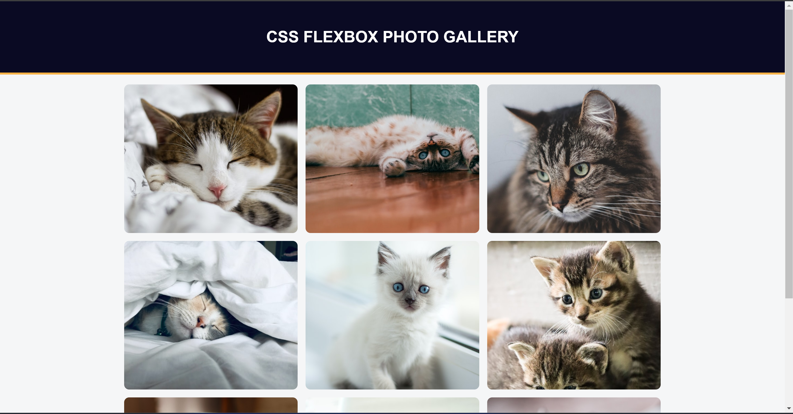

# Photo Gallery

## Description

This project is a simple photo gallery showcasing cat images. Built using HTML and CSS, it utilizes Flexbox to create a responsive and visually appealing layout. The gallery is designed to adapt to various screen sizes, ensuring a consistent viewing experience across devices.

For a detailed guide on Flexbox and CSS Grid layouts, you might find the [FreeCodeCamp](https://www.freecodecamp.org/) resources helpful.

## Features

- **Responsive Design**: Adjusts layout for different screen sizes using Flexbox.
- **Image Styling**: Uniform image sizes with rounded corners and cover fit.
- **Modern UI**: Clean and simple design with a focus on usability.

## Visuals

### Screenshot

.

## Installation

To get started with the photo gallery:

1. **Clone the Repository**

   ```bash
   git clone https://gitlab.com/Yashi-Singh-9/a-photo-gallery.git
   ```

2. **Navigate to the Project Directory**

   ```bash
   cd a-photo-gallery
   ```

3. **Open the HTML File**

   Open `index.html` in a web browser to view the gallery.

## Usage

The gallery displays images in a responsive grid. Images are automatically arranged and resized to fit within their containers. You can add or replace images by modifying the `index.html` file.

## Support

For any questions or issues, please raise an issue on the [GitLab repository](https://gitlab.com/Yashi-Singh-9/a-photo-gallery/issues).

## Roadmap

Future improvements may include:

- Adding lightbox functionality to view images in full-screen mode.
- Implementing a search feature to filter images.
- Adding transition effects and animations.

## Contributing

Contributions are welcome! If you'd like to contribute:

1. Fork the repository.
2. Create a new branch (`git checkout -b feature-branch`).
3. Make your changes and commit them (`git commit -am 'Add new feature'`).
4. Push to the branch (`git push origin feature-branch`).
5. Create a new Pull Request.

Please ensure that your changes adhere to the project's coding standards and include relevant tests if applicable.

## Authors and Acknowledgment

This project was created with the help of FreeCodeCamp. Special thanks to the FreeCodeCamp community for their valuable resources and inspiration.